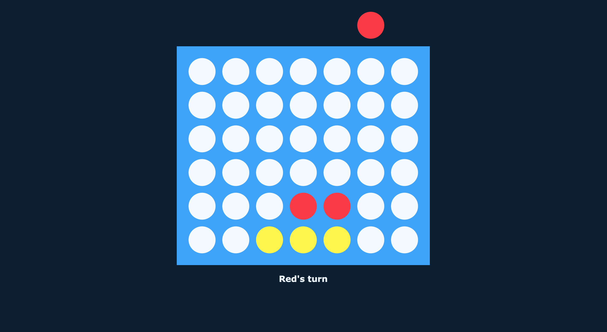

# Minimalist Connect 4
I decided I wanted to make connect 4, so I did. It's not finished yet, but it looks nice.
[Try it out!](https://jmang00.github.io/minimalist-connect-4/)

## To do
- ~~Add game over logic~~
- ~~Add a few text instructions (yellow's turn, game over, red wins etc)~~
- ~~'It's a draw' when there are no spaces left~~
- ~~Fix a bug where hovering/clicking don't do anything~~ (I think)
- ~~Fix a bug where the token stays hanging~~ (I think)
- Add a reset/play again button
- Make a bot to play against
- Add a header

